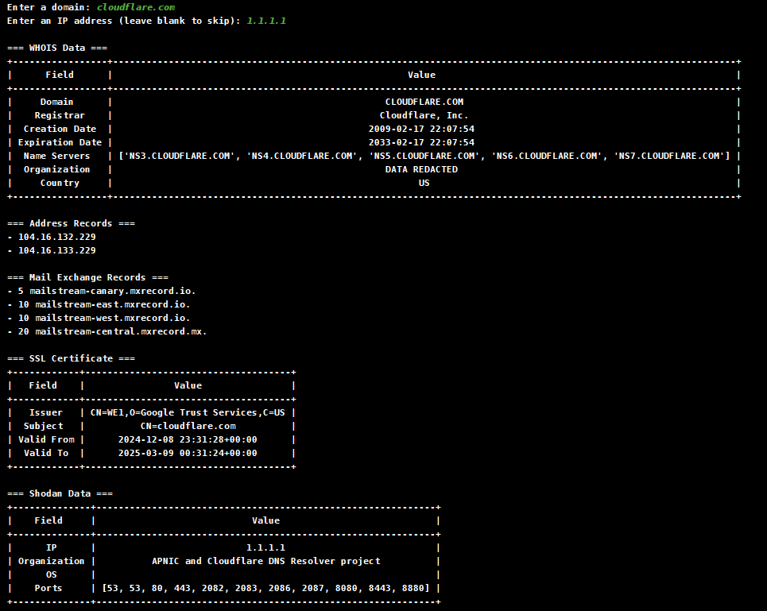

# OSINT Recon 

## Features
- **WHOIS Lookups**: Retrieve domain registration and ownership information including registrar, creation date, expiration date, and name servers.
- **DNS Address Records**: Fetch the IP addresses associated with the domain.
- **DNS Mail Exchange Records**: Retrieve the mail servers associated with the domain.
- **SSL Certificate Info**: Analyze SSL certificates to extract issuer, subject, and validity periods, helping to assess the security of the domain.
- **Shodan Data**: Fetch detailed information from Shodan for a given IP address, such as open ports, organization, and detected operating system.

## Showcase



## Installation
1. Clone the repository:
   ```bash
   git clone https://github.com/GitEagleY/OSINT_Recon.git
   cd OSINT_Recon
   ```
2. Install dependencies:
   ```bash
   pip install -r requirements.txt
   ```

## Launch the Tool
Run the tool from the command line:
```bash
python main.py
```

